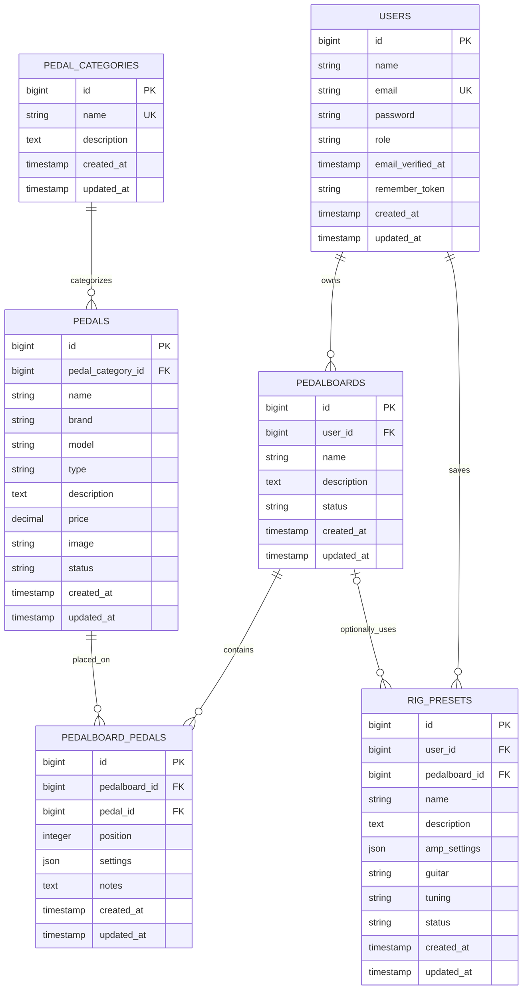

# ToneVault Database Design and ERD

## Overview

The application database has six main tables: `users`, `pedal_categories`,
`pedals`, `pedalboards`, `pedalboard_pedals`, and `rig_presets`. This provides
five related tables in addition to `users`, exceeding the exam requirement of
at least three related tables besides users.

The Laravel authentication scaffold may also use infrastructure tables such as
`password_reset_tokens` and `sessions`; they are not part of the ToneVault
domain ERD.

## Entity relationship diagram

`rig_presets.pedalboard_id` is nullable. A rig can be saved without a
pedalboard, or can optionally refer to one of the same user's boards.

## Table definitions

All `id` columns use Laravel's `$table->id()` convention: an unsigned,
auto-incrementing BIGINT primary key. Unless stated otherwise, foreign keys are
unsigned BIGINTs and `created_at`/`updated_at` are nullable Laravel timestamps
created with `$table->timestamps()`.

### `users`

| Column | Suggested type | Nullable | Key / rule |
| --- | --- | --- | --- |
| `id` | BIGINT UNSIGNED | No | Primary key. |
| `name` | VARCHAR(255) | No | User's display name. |
| `email` | VARCHAR(255) | No | Unique login email. |
| `email_verified_at` | TIMESTAMP | Yes | Laravel-compatible verification timestamp. |
| `password` | VARCHAR(255) | No | Store a secure password hash only. |
| `role` | VARCHAR(20) | No | Default `guitarist`; values `guitarist` or `admin`; index. |
| `remember_token` | VARCHAR(100) | Yes | Laravel-compatible remember token. |
| `created_at` | TIMESTAMP | Yes | Creation timestamp. |
| `updated_at` | TIMESTAMP | Yes | Last update timestamp. |

Registration must assign `guitarist` on the server. A public request must not
be allowed to assign or change its own role.

### `pedal_categories`

| Column | Suggested type | Nullable | Key / rule |
| --- | --- | --- | --- |
| `id` | BIGINT UNSIGNED | No | Primary key. |
| `name` | VARCHAR(100) | No | Unique category name. |
| `description` | TEXT | Yes | Optional category description. |
| `created_at` | TIMESTAMP | Yes | Creation timestamp. |
| `updated_at` | TIMESTAMP | Yes | Last update timestamp. |

### `pedals`

| Column | Suggested type | Nullable | Key / rule |
| --- | --- | --- | --- |
| `id` | BIGINT UNSIGNED | No | Primary key. |
| `pedal_category_id` | BIGINT UNSIGNED | No | Foreign key to `pedal_categories.id`; index. |
| `name` | VARCHAR(150) | No | Catalog name. |
| `brand` | VARCHAR(100) | No | Manufacturer. |
| `model` | VARCHAR(100) | Yes | Optional model identifier. |
| `type` | VARCHAR(50) | Yes | Optional effect subtype. |
| `description` | TEXT | Yes | Optional catalog description. |
| `price` | DECIMAL(10,2) | Yes | Optional non-negative price. |
| `image` | VARCHAR(255) | Yes | Optional image storage path. |
| `status` | VARCHAR(20) | No | Default `active`; values `active` or `inactive`; index. |
| `created_at` | TIMESTAMP | Yes | Creation timestamp. |
| `updated_at` | TIMESTAMP | Yes | Last update timestamp. |

Add a composite index on (`pedal_category_id`, `status`) for category/status
filtering and one on (`brand`, `name`) for common search filtering.

### `pedalboards`

| Column | Suggested type | Nullable | Key / rule |
| --- | --- | --- | --- |
| `id` | BIGINT UNSIGNED | No | Primary key. |
| `user_id` | BIGINT UNSIGNED | No | Foreign key to `users.id`; index; board owner. |
| `name` | VARCHAR(150) | No | Board name. |
| `description` | TEXT | Yes | Optional board notes. |
| `status` | VARCHAR(20) | No | Default `active`; values `active` or `archived`; index. |
| `created_at` | TIMESTAMP | Yes | Creation timestamp. |
| `updated_at` | TIMESTAMP | Yes | Last update timestamp. |

Add a composite index on (`user_id`, `status`) for a user's board list. A
unique constraint on (`user_id`, `name`) is optional if board names should be
unique per user.

### `pedalboard_pedals`

| Column | Suggested type | Nullable | Key / rule |
| --- | --- | --- | --- |
| `id` | BIGINT UNSIGNED | No | Primary key. |
| `pedalboard_id` | BIGINT UNSIGNED | No | Foreign key to `pedalboards.id`; index. |
| `pedal_id` | BIGINT UNSIGNED | No | Foreign key to `pedals.id`; index. |
| `position` | INT UNSIGNED | No | Position in signal chain; use one-based ordering consistently. |
| `settings` | JSON | Yes | Optional pedal-specific settings for this board. |
| `notes` | TEXT | Yes | Optional placement notes. |
| `created_at` | TIMESTAMP | Yes | Creation timestamp. |
| `updated_at` | TIMESTAMP | Yes | Last update timestamp. |

This table implements the many-to-many relationship and holds attributes that
belong to a pedal's placement on a particular board. Add unique constraints on
(`pedalboard_id`, `pedal_id`) and (`pedalboard_id`, `position`) so the same
pedal cannot be added twice to one board and positions cannot collide. Reorder
operations should use a database transaction and temporary positions while
swapping existing positions.

### `rig_presets`

| Column | Suggested type | Nullable | Key / rule |
| --- | --- | --- | --- |
| `id` | BIGINT UNSIGNED | No | Primary key. |
| `user_id` | BIGINT UNSIGNED | No | Foreign key to `users.id`; index; rig owner. |
| `pedalboard_id` | BIGINT UNSIGNED | Yes | Optional foreign key to `pedalboards.id`; index. |
| `name` | VARCHAR(150) | No | Preset name. |
| `description` | TEXT | Yes | Optional sound/use description. |
| `amp_settings` | JSON | Yes | Optional structured amplifier settings. |
| `guitar` | VARCHAR(100) | Yes | Optional guitar/instrument description. |
| `tuning` | VARCHAR(50) | Yes | Optional tuning, e.g. `Drop D`. |
| `status` | VARCHAR(20) | No | Default `draft`; values `draft`, `pending`, `approved`, `rejected`; index. |
| `created_at` | TIMESTAMP | Yes | Creation timestamp. |
| `updated_at` | TIMESTAMP | Yes | Last update timestamp. |

Add composite indexes on (`user_id`, `status`) for the user's preset list and
(`status`, `created_at`) for the admin review queue. If a board is attached,
the API must ensure it belongs to the same user as the preset.

## Relationships and referential rules

| Parent / child | Relationship | Eloquent relationship | Foreign-key behavior |
| --- | --- | --- | --- |
| `users` → `pedalboards` | One user has many boards. | `User::hasMany(Pedalboard::class)`; `Pedalboard::belongsTo(User::class)` | Cascade board deletion when an authorized user deletion occurs. |
| `users` → `rig_presets` | One user has many presets. | `User::hasMany(RigPreset::class)`; `RigPreset::belongsTo(User::class)` | Cascade preset deletion when an authorized user deletion occurs. |
| `pedal_categories` → `pedals` | One category has many pedals. | `PedalCategory::hasMany(Pedal::class)`; `Pedal::belongsTo(PedalCategory::class)` | Restrict category deletion while pedals reference it. |
| `pedalboards` ↔ `pedals` | Many-to-many through `pedalboard_pedals`. | `belongsToMany()` in both directions; include pivot `id`, `position`, `settings`, `notes` and pivot timestamps. | Cascade pivot deletion with board deletion; restrict pedal deletion while referenced by a pivot. |
| `pedalboards` → `rig_presets` | A board may be used by many presets; a preset may have zero or one board. | `Pedalboard::hasMany(RigPreset::class)`; `RigPreset::belongsTo(Pedalboard::class)` | Set `pedalboard_id` to `NULL` when deleting a board, preserving the preset. |

Use `ON UPDATE CASCADE` for foreign keys; IDs should otherwise be immutable.
The API should confirm destructive user actions before relying on cascades.
Catalog rows should not be removed while referenced; admins can mark pedals
inactive instead.

## Status, validation, and access rules

- `users.role`: `guitarist` or `admin`; public registration always creates a
  guitarist.
- `pedals.status`: `active` or `inactive`. Inactive pedals are hidden from
  normal library results but can remain on existing boards.
- `pedalboards.status`: `active` or `archived`.
- `rig_presets.status`: `draft`, `pending`, `approved`, or `rejected`.
  Submission moves an eligible draft/rejected preset to `pending`; only an
  admin can approve or reject it.
- Validate non-negative prices, existing foreign-key IDs, valid status values,
  and non-negative/unique board positions.
- Use Laravel FormRequests for validation and authorization policies for role
  and ownership checks. A guitarist may only access their own boards and
  presets. Database constraints supplement but do not replace API checks.

## Existing project note

The current users migration at
`backend/database/migrations/0001_01_01_000000_create_users_table.php` has the
standard Laravel fields but no `role` column. This ERD is a design document; it
does not change or run migrations. When implementing, add a migration for the
role if the current migration has already been applied, and create migrations
for the remaining domain tables.
